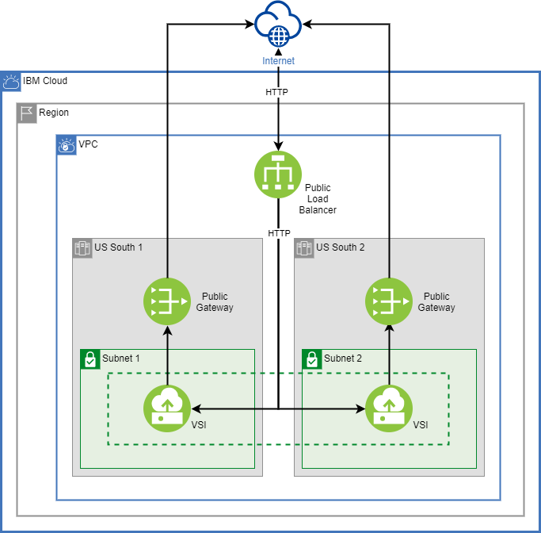

## Terraform CDK Example

This repository contains an example on how to manage resources using Cloud Development Kit

### Architecture 



The resources include:

* 1 VPC.
* 2 Subnets.
* 2 Public Gateways.
* 1 Public Load Balancer.
* 1 Security Group
* 1 Instance group to handle our instances.

### Deploy

You need to export some variables and install the IBM CLI

```sh
$ export IC_API_KEY=<your_ibm_cloud_api_key>
$ export ETCD_HOST=<your_etcd_host_with_protocol_and_port>
$ export ETCD_USERNAME=<your_etcd_user>
$ export ETCD_PASSWORD=<your_etcd_password>
$ export TF_VAR_base_name=<resources_base_name>
$ curl -fsSL https://clis.cloud.ibm.com/install/linux | sh
$ ibmcloud login -a cloud.ibm.com -r us-south --apikey $IC_API_KEY
$ ibmcloud plugin install cdb
$ ibmcloud cdb deployment-cacert Terraform-etcd --save --certroot cacert && mv cacert/* ca.crt && rmdir cacert
$ openssl req -newkey rsa:2048 -nodes -keyout key.pem -x509 -days 365 -out certificate.pem -subj "/C=PE/ST=Lima/L=Lima/OU=Terraform"
```

To create the resources directly run the following commands:

```sh
$ cdktf get
$ cdktf deploy
```

To create the resources using terraform cli:


```sh
cdktf get
cdktf synth
cd cdktf.out
terraform plan
terraform apply 
```
### Travis CI

This repository also includes a Travis build configuration [file](./.travis.yml) 

It contains a job triggered by pull requests that will synthetize the JSON file that allows to run terraform plan to validate the changes.

```yml
- stage: terraform plan
      if: type IN (pull_request)
      script:
        - echo "Synthetizing Terraform JSON File"
        - npm install
        - npm run get
        - npm run synth
        - cd cdktf.out
        - terraform init
        - terraform plan
```

Also contains a job triggered by push operation to the master branch that will create our resources on IBM Cloud

```yml
if: type IN (push) and branch = master
      script:
        - echo "Synthetizing Terraform JSON File"
        - npm install
        - npm run get
        - npm run synth
        - echo "Executing Terraform Apply on merged code"
        - cd cdktf.out
        - terraform init
        - terraform apply $tf_apply_cli_options
```